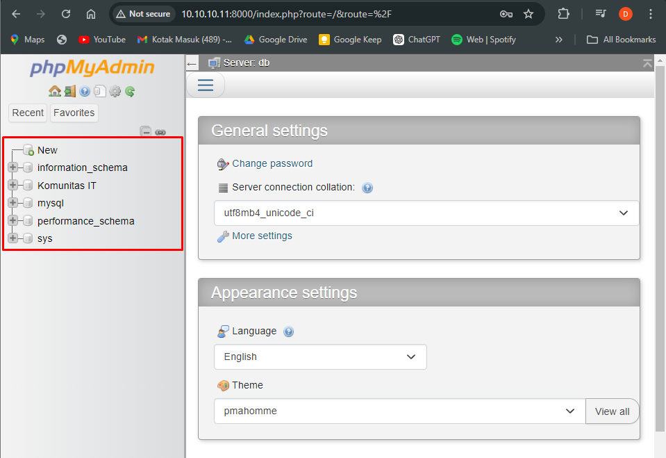

<!-- Heading -->
<h1 align="center">3. Management Container</h1>

## 3.1 Container Resource Limit
secara default saat container berjalan maka dia akan menggunakan semua CPU dan Memory yang tersedia pada sistem host, tentunya hal ini akan memengaruhi container lain jika resource yang di gunakan terlalu banyak. untuk itu Container Resource Limit ini perlu di atur saat pembuatan container.
 ```js
dika@docker-dika-node01:~$ sudo docker run -d --name db-mysql --memory 100m --cpus 0.5 -e MYSQL_ROOT_PASSWORD=kits123 -e MYSQL_DATABASE="Komunitas IT" -p 3306:3306 mysql:latest
```

## 3.2 Container Link 
setelah container mysql sudah terinstall disini buat container phpmyadmin dan hubungkan ke container mysql. gunakan opsi `--link` untuk menghubungkan ke container database mysql
 ```js
dika@docker-dika-node01:~$ sudo docker run -d --name phpmyadmin --link db-mysql:db -p 8000:80 phpmyadmin:latest
```

>Open browser and access ip_address:port
<p align="center">
  
</p>
<p align="center">
  
</p>

## 3.3 Docker Volume
docker volume seperti sebuah storage yang digunakan docker untuk menyimpan data, by default volume auto generate saat membuat ataupun menjalankan container

> 3.3.1 Mount Volume with busybox

buat directory baru dan isi dengan sebuah data sederhana
```js
dika@docker-dika-node01:~$ for i in {1..3};do mkdir data-kits/komunitas-it-$i;done && for i in {1..3};do echo "Komunitas IT #$i" > data-kits/komunitas-it-$i/data.txt;done
dika@docker-dika-node01:~$ tree
.
├── data-kits
│   ├── komunitas-it-1
│   │   └── data.txt
│   ├── komunitas-it-2
│   │   └── data.txt
│   └── komunitas-it-3
│       └── data.txt
└── snap
    └── docker
        ├── 2932
        ├── common
        └── current -> 2932

10 directories, 3 files
dika@docker-dika-node01:~$
```

create volume forkits
 ```js
dika@docker-dika-node01:~$ sudo docker volume create forkits
[sudo] password for dika: 
forkits
dika@docker-dika-node01:~$ sudo docker volume ls
DRIVER    VOLUME NAME
local     79cc97991f06eaa6d2450367be7bf3637fa18d41426d7c1316e164465c11c067
local     forkits
```

lakukan pull image `busybox` (perangkat lunak yang menggabungkan berbagai perintah dan utilitas dasar Unix/Linux ke dalam satu file eksekusi tunggal yang ringan)
```js
dika@docker-dika-node01:~$ sudo docker pull busybox:latest
latest: Pulling from library/busybox
2fce1e0cdfc5: Pull complete
Digest: sha256:c230832bd3b0be59a6c47ed64294f9ce71e91b327957920b6929a0caa8353140
Status: Downloaded newer image for busybox:latest
docker.io/library/busybox:latest
dika@docker-dika-node01:~$ sudo docker images
REPOSITORY   TAG       IMAGE ID       CREATED         SIZE
phpmyadmin   latest    2c40d71042e9   2 weeks ago     562MB
nginx        latest    39286ab8a5e1   5 weeks ago     188MB
mysql        latest    680b8c60dce6   8 weeks ago     586MB
busybox      latest    6fd955f66c23   16 months ago   4.26MB
```
deploy volume yang telah terbuat kedalam container busybox
```js
dika@docker-dika-node01:~$ sudo docker create -v /forkits --name KITS busybox
623771f81f7ab1d349504de044d66a65e9be7b351bc8b1c49ea3209499627f0a
dika@docker-dika-node01:~$ sudo docker ps -a
CONTAINER ID   IMAGE     COMMAND   CREATED         STATUS    PORTS     NAMES
623771f81f7a   busybox   "sh"      9 seconds ago   Created             KITS
```
copy data yang dibuat diawal kedalam volume busybox
```js
dika@docker-dika-node01:~$ cd data-kits/
dika@docker-dika-node01:~/data-kits$ sudo docker cp . KITS:/forkits
Successfully copied 6.14kB to KITS:/forkits
```
test volume dengan membuat 1 container ubuntu dan lakukan mount ke volume busybox. jika sudah masuk kedalam container jalankan periuntah `df -h` dan `lsblk -l` untuk melihat mounted volume
```js
dika@docker-dika-node01:~$ sudo docker run -it --volumes-from KITS ubuntu /bin/bash
root@f0412ed18b88:/# df -h
Filesystem      Size  Used Avail Use% Mounted on
overlay          20G  6.0G   13G  33% /
tmpfs            64M     0   64M   0% /dev
shm              64M     0   64M   0% /dev/shm
/dev/sda2        20G  6.0G   13G  33% /forkits
tmpfs           457M     0  457M   0% /proc/asound
tmpfs           457M     0  457M   0% /proc/acpi
tmpfs           457M     0  457M   0% /proc/scsi
tmpfs           457M     0  457M   0% /sys/firmware
root@f0412ed18b88:/# lsblk -l
NAME  MAJ:MIN RM  SIZE RO TYPE MOUNTPOINTS
loop0   7:0    0 74.3M  1 loop
loop1   7:1    0  132M  1 loop
loop2   7:2    0 38.8M  1 loop
sda     8:0    0   20G  0 disk
sda1    8:1    0    1M  0 part
sda2    8:2    0   20G  0 part /etc/hosts
                               /etc/hostname
                               /etc/resolv.conf
                               /forkits
sr0    11:0    1  2.6G  0 rom
```
terakhir test `ls -R` dan `cat` semua isi file data yang dimasukkan kedalam volume 
```js
root@f0412ed18b88:/# ls -R forkits/
forkits/:
komunitas-it-1  komunitas-it-2  komunitas-it-3

forkits/komunitas-it-1:
data.txt

forkits/komunitas-it-2:
data.txt

forkits/komunitas-it-3:
data.txt

root@f0412ed18b88:/# for x in {1..3}; do cat forkits/komunitas-it-$x/data.txt; done
Komunitas IT #1
Komunitas IT #2
Komunitas IT #3
```
<hr />

> 3.3.2 Mount Volume with NFS 

create directory yang ingin di share, untuk share disini kita gunakan directory data-kits sebelumnya
```js
dika@docker-dika-node01:~$ tree data-kits/
data-kits/
├── komunitas-it-1
│   └── data.txt
├── komunitas-it-2
│   └── data.txt
└── komunitas-it-3
    └── data.txt

4 directories, 3 files
dika@docker-dika-node01:~$
```

run container baru dengan images nfs dan share directory arahin ke `data-kits`
```js
dika@docker-dika-node01:~$ sudo docker run -d --name nfs-server-dika --restart unless-stopped --privileged -e SHARED_DIRECTORY=/data -v ~/data-kits:/data -p 2049:2049 itsthenetwork/nfs-serv
er-alpine
Unable to find image 'itsthenetwork/nfs-server-alpine:latest' locally
latest: Pulling from itsthenetwork/nfs-server-alpine
bdf0201b3a05: Pull complete
8e751f03d47e: Pull complete
68ecfeaf6b18: Pull complete
9b7b81142e96: Pull complete
636af84da018: Pull complete
b266affcdfe5: Pull complete
Digest: sha256:7fa99ae65c23c5af87dd4300e543a86b119ed15ba61422444207efc7abd0ba20
Status: Downloaded newer image for itsthenetwork/nfs-server-alpine:latest
44b3f62844af306385115c7b21732958372f968fbdaa0cc3f011b34efc292ef0
dika@docker-dika-node01:~$ sudo docker ps
CONTAINER ID   IMAGE                             COMMAND              CREATED         STATUS         PORTS                                       NAMES
44b3f62844af   itsthenetwork/nfs-server-alpine   "/usr/bin/nfsd.sh"   6 seconds ago   Up 4 seconds   0.0.0.0:2049->2049/tcp, :::2049->2049/tcp   nfs-server-dika
dika@docker-dika-node01:~$
```
`options docker run container nfs:`
```js
--restart unless-stopped  //mengatur container restart secara otomatis kecuali dihentikan oleh user
--privileged  //hak akses penuh ke container
-e SHARED_DIRECTORY=/data //menentukan environment path directory yang akan di ekspos oleh nsf server
-v ~/data-kits:/data  //mount directory sumber ke directory /data sebagai storage yang dapat diakses melalui NFS
-p 2049:2049 //port default NFS
```

test pada `docker-dika-node02`, install nfs client untuk akses server nfs
```js
dika@docker-dika-node02:~$ sudo apt install nfs-common 
Reading package lists... Done
Building dependency tree... Done
Reading state information... Done
nfs-common is already the newest version (1:2.6.4-3ubuntu5).
0 upgraded, 0 newly installed, 0 to remove and 25 not upgraded.
```

make directory dan lakukan mount ke server nfs
```js
dika@docker-dika-node02:~$ mkdir data
dika@docker-dika-node02:~$ tree
.
└── data

2 directories, 0 files

dika@docker-dika-node02:~$ sudo mount -v -t nfs4 10.10.10.11:/ data/
mount.nfs4: timeout set for Fri Sep 20 02:50:34 2024
mount.nfs4: trying text-based options 'vers=4.2,addr=10.10.10.11,clientaddr=10.10.10.12'   

dika@docker-dika-node02:~$ df -h
Filesystem      Size  Used Avail Use% Mounted on
tmpfs            92M  1.4M   91M   2% /run
/dev/sda2        20G  4.4G   15G  24% /
tmpfs           457M     0  457M   0% /dev/shm
tmpfs           5.0M     0  5.0M   0% /run/lock
tmpfs            92M   12K   92M   1% /run/user/1000
10.10.10.11:/    20G  6.1G   13G  33% /home/dika/data
dika@docker-dika-node02:~$ tree data/
data/
├── komunitas-it-1
│   └── data.txt
├── komunitas-it-2
│   └── data.txt
└── komunitas-it-3
    └── data.txt

4 directories, 3 files
```
sekarang buat directory data kits menjadi 10 list data dari `docker-dika-node02`
```js
dika@docker-dika-node02:~$ for i in {4..10}; do mkdir data/komunitas-it-$i;done && for i in {4
..10}; do echo "Komunitas IT#$i" > data/komunitas-it-$i/data.txt; done
```

cek di `docker-dika-node01`
```js
dika@docker-dika-node01:~$ tree -v
.
├── data-kits
│   ├── komunitas-it-1
│   │   └── data.txt
│   ├── komunitas-it-2
│   │   └── data.txt
│   ├── komunitas-it-3
│   │   └── data.txt
│   ├── komunitas-it-4
│   │   └── data.txt
│   ├── komunitas-it-5
│   │   └── data.txt
│   ├── komunitas-it-6
│   │   └── data.txt
│   ├── komunitas-it-7
│   │   └── data.txt
│   ├── komunitas-it-8
│   │   └── data.txt
│   ├── komunitas-it-9
│   │   └── data.txt
│   └── komunitas-it-10
│       └── data.txt
└── snap
    └── docker
        ├── 2932
        ├── common
        └── current -> 2932

17 directories, 10 files
dika@docker-dika-node01:~$
```

> 3.3.3 Docker Volume Permission
sesuai namanya docker volume permissions mengatur hak akses untuk container ketika volume di mount kedalam container. by default saat mount tanpa mendefinisikan permission maka hak akses container terhadap volume tersebut adalah rw (read write).

1. Read Write
create new volume dan mount kedalam container baru lalu pastikan <b>RW: true</b> pada saat dilakukan inspect pada container.
```js
dika@docker-dika-node01:~$ sudo docker volume create rw-volume 
[sudo] password for dika: 
rw-volume
dika@docker-dika-node01:~$ sudo docker run -d --name nginx-rw -v rw-volume:/usr/share/nginx/h
tml -p 8080:80 nginx:latest
36de99619beb2df1a68184c380da5e9cbe665572c88cbe688925894e733cab95
dika@docker-dika-node01:~$ sudo docker inspect nginx-rw | grep -i mounts -A10
        "Mounts": [
            {
                "Type": "volume",
                "Name": "rw-volume",
                "Source": "/var/snap/docker/common/var-lib-docker/volumes/rw-volume/_data",  
                "Destination": "/usr/share/nginx/html",
                "Driver": "local",
                "Mode": "z",
                "RW": true,
                "Propagation": ""
            }
```
kemudian ubah isi content pada nginx lalu verify dengan curl 
```js
dika@docker-dika-node01:~$ sudo docker exec -it nginx-rw bash -c 'echo "The Usefull IT" > /usr/share/nginx/html/index.html'
dika@docker-dika-node01:~$ sudo docker inspect nginx-rw | grep -i ipaddress
            "SecondaryIPAddresses": null,
            "IPAddress": "172.17.0.3",
                    "IPAddress": "172.17.0.3",
dika@docker-dika-node01:~$ curl 127.17.0.3:8080
The Usefull IT
```

2. Read-Only
sesuai namanya hak akses read-only yang diterapkan ke dalam sebuah container akan membuat container hanya bisa membaca resource pada sebuah volume. ulangi konfigurasi seperti sebelumnya 
```js
dika@docker-dika-node01:~$ sudo docker volume create ro-volume
ro-volume
dika@docker-dika-node01:~$ sudo docker run -d --name nginx-ro -v ro-volume:/usr/share/nginx/h
tml:ro -p 8081:80 nginx:latest
160c2e57c3a8abfcb6c769a99a788455b6cd74643eabe01e4b2101203f5b4e0c

// terlihat hasil inspect berbeda pada sebelumnya, karena hak akses yang diberikan read-only maka pada status RW akan false
dika@docker-dika-node01:~$ sudo docker inspect nginx-ro | grep -i mounts -A10
        "Mounts": [
            {
                "Type": "volume",
                "Name": "ro-volume",
                "Source": "/var/snap/docker/common/var-lib-docker/volumes/ro-volume/_data",  
                "Destination": "/usr/share/nginx/html",
                "Driver": "local",
                "Mode": "ro",
                "RW": false,
                "Propagation": ""
            }
```

dan saat dilakukan uji coba untuk merubah isi content nginx dari internal container maka akan muncul output `Read-Only`
```js
dika@docker-dika-node01:~$ sudo docker exec -it nginx-ro bash -c 'echo "Komunitas IT 2024" > 
/usr/share/nginx/html/index.html'
bash: line 1: /usr/share/nginx/html/index.html: Read-only file system
```

namun jika ingin merubah isi content pada nginx kita bisa lakukan pada terminal host docker atau external container, karena diawal yang diberi read-only saja hanya pada container. jika sudah verify dengan curl 
```js
dika@docker-dika-node01:~$ echo "Komunitas IT 2024" > index.html && sudo cp index.html /var/snap/docker/common/var-lib-docker/volumes/ro-volume/_data

dika@docker-dika-node01:~$ sudo docker inspect nginx-ro | grep -i ipaddress
            "SecondaryIPAddresses": null,
            "IPAddress": "172.17.0.4",
                    "IPAddress": "172.17.0.4",

dika@docker-dika-node01:~$ curl 172.17.0.4
Komunitas IT 2024
```