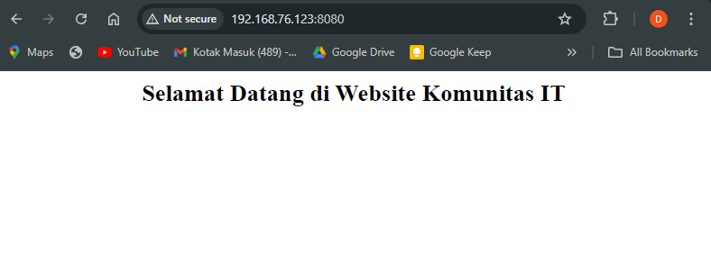

<!-- Heading -->
<h1 align="center">Basic Command</h1>

## Docker Search
Docker Serach digunakan untuk mencari image pada repository. by default menggunakan repository docker hub

> Example: Search Nginx
```js
dika@docker-dika-node01:~$ sudo docker search nginx
[sudo] password for dika: 
NAME                              DESCRIPTION                                     STARS     OFFICIAL
nginx                             Official build of Nginx.                        20206     [OK]
nginx/nginx-prometheus-exporter   NGINX Prometheus Exporter for NGINX and NGIN…   43        
nginx/nginx-ingress               NGINX and  NGINX Plus Ingress Controllers fo…   94        
nginx/unit                        This repository is retired, use the Docker o…   63        
nginx/nginx-quic-qns              NGINX QUIC interop                              1         

kasmweb/nginx                     An Nginx image based off nginx:alpine and in…   8
rancher/nginx                                                                     2
redash/nginx                      Pre-configured nginx to proxy linked contain…   2
youstin/nginx                                                                     0
bitnamicharts/nginx                                                               0
rapidfort/nginx                   RapidFort optimized, hardened image for NGINX   15
paketobuildpacks/nginx                                                            0
wodby/nginx                       Generic nginx                                   2
bitwarden/nginx                   The Bitwarden nginx web server acting as a r…   13
starojanje/nginx                                                                  0
rasa/nginx                        Rasa X nginx server                             2
gluufederation/nginx               A customized NGINX image containing a consu…   1
arm64v8/nginx                     Official build of Nginx.                        50
nsilpanisong/nginx                Repository used to test nginx                   0
mtinny/nginx                      https://github.com/mtinny/k8s-nginx-toolbox     0
```

## Pull Image
pull image digunakan untuk mengambil image dari registry atau repository. by default tag yang digunakan adalah latest jika tidak mendefiniskan tag 
> Example: Pull Nginx
```js
dika@docker-dika-node01:~$ sudo docker pull nginx
Using default tag: latest
latest: Pulling from library/nginx
a2318d6c47ec: Pull complete
095d327c79ae: Pull complete
bbfaa25db775: Pull complete
7bb6fb0cfb2b: Pull complete
0723edc10c17: Pull complete
24b3fdc4d1e3: Pull complete
3122471704d5: Pull complete
Digest: sha256:04ba374043ccd2fc5c593885c0eacddebabd5ca375f9323666f28dfd5a9710e3
Status: Downloaded newer image for nginx:latest
docker.io/library/nginx:latest
```

## Docker Image
1. Melihat daftar list image
```js
dika@docker-dika-node01:~$ sudo docker image ls
REPOSITORY   TAG       IMAGE ID       CREATED       SIZE
nginx        latest    39286ab8a5e1   4 weeks ago   188MB
```

2. Menghapus image
```js
dika@docker-dika-node01:~$ sudo docker image rm nginx
Untagged: nginx:latest
Untagged: nginx@sha256:04ba374043ccd2fc5c593885c0eacddebabd5ca375f9323666f28dfd5a9710e3
Deleted: sha256:39286ab8a5e14aeaf5fdd6e2fac76e0c8d31a0c07224f0ee5e6be502f12e93f3
Deleted: sha256:d71f9b66dd3f9ef3164d7023cc99ce344d209decd5d6cd56166c0f7a2f812c06
Deleted: sha256:634d30adf8a2232256b2871e268c8f0fdb2c348374cd8510920a76db56868e16
Deleted: sha256:f230be3f4e104c7414b7ce9c8d301f37061b4e06afe010878ea55f858d89f7f3
Deleted: sha256:c5210c8480131b7dbc5ad8adc425d68cd7a8848ee2e07de3c69cb88a4b8fd662
Deleted: sha256:d4f588811a337e0b01da46772d02f7f82ee5f9baff6886365ffb912d455f4f53
Deleted: sha256:d73e21a1e27b0184b36f6578c8d0722a44da253bc74cd72e9788763f4a4de08f
Deleted: sha256:8e2ab394fabf557b00041a8f080b10b4e91c7027b7c174f095332c7ebb6501cb

dika@docker-dika-node01:~$ sudo docker image ls
REPOSITORY   TAG       IMAGE ID   CREATED   SIZE
```

## Docker Run
docker run digunakan untuk membuat dan menjalankan container. jika image sumber tidak ada maka akan secara otomatis pull dari repository default docker hub.
> Example: create container nginx
```js
dika@docker-dika-node01:~$ sudo docker run -d --name web-kits -p 8080:80 nginx:latest
Unable to find image 'nginx:latest' locally
latest: Pulling from library/nginx
a2318d6c47ec: Pull complete
095d327c79ae: Pull complete
bbfaa25db775: Pull complete
7bb6fb0cfb2b: Pull complete
0723edc10c17: Pull complete
24b3fdc4d1e3: Pull complete
3122471704d5: Pull complete
Digest: sha256:04ba374043ccd2fc5c593885c0eacddebabd5ca375f9323666f28dfd5a9710e3
Status: Downloaded newer image for nginx:latest
03ed4f00840d50a2c15ebf922cab2676d7ee975673d93de557e91075974178ce
```
> Options pada docker run
```js
-d		//untuk menjalankan container dalam mode dedicated atau berjalan di latar belakang.
--name		//digunakan untuk memberikan sebuah nama untuk container
-p 8080:80	//port pertama digunakan untuk mendefinisikan port pada host. dan port kedua adalah port didalam container
```

>Open browser and access ip_address:port
<p align="center">
  
</p>

##  Docker Container
> docker container ls
untuk melihat daftar list container yang sedang up
```js
dika@docker-dika-node01:~$ sudo docker container ls
CONTAINER ID   IMAGE          COMMAND                  CREATED          STATUS          PORTS                                     NAMES
03ed4f00840d   nginx:latest   "/docker-entrypoint.…"   23 minutes ago   Up 23 minutes   0.0.0.0:8080->80/tcp, [::]:8080->80/tcp   web-kits
```

> docker container stop
untuk stop prossess pada container
 ```js
dika@docker-dika-node01:~$ sudo docker container stop web-kits
web-kits
dika@docker-dika-node01:~$ sudo docker container ls
CONTAINER ID   IMAGE     COMMAND   CREATED   STATUS    PORTS     NAMES
```

> docker container start
digunakan untuk menjalankan container
 ```js
dika@docker-dika-node01:~$ sudo docker container start web-kits
web-kits
dika@docker-dika-node01:~$ sudo docker container ls
CONTAINER ID   IMAGE          COMMAND                  CREATED          STATUS         PORTS                                     NAMES
03ed4f00840d   nginx:latest   "/docker-entrypoint.…"   29 minutes ago   Up 5 seconds   0.0.0.0:8080->80/tcp, [::]:8080->80/tcp   web-kits
```

> docker container inspect
melihat detail informasi pada container seperti tanggal pembuatan, IP Address, MAC Address
 ```js
dika@docker-dika-node01:~$ sudo docker container inspect web-kits
[
    {
        "Id": "03ed4f00840d50a2c15ebf922cab2676d7ee975673d93de557e91075974178ce",
        "Created": "2024-09-18T07:12:52.455670041Z",
        "Path": "/docker-entrypoint.sh",
        "Args": [
            "nginx",
            "-g",
            "daemon off;"
        ],
        "State": {
            "Status": "running",
            "Running": true,
            "Paused": false,
            "Restarting": false,
            "OOMKilled": false,
            "Dead": false,
            "Pid": 57214,
            "ExitCode": 0,
            "Error": "",
            "StartedAt": "2024-09-18T07:42:12.597151707Z",    
            "FinishedAt": "2024-09-18T07:40:29.999177049Z"    
        },
```

> docker container rm -f
untuk menghapus sebuah container, by default container yang masih up harus di stop terlebih dahulu jika ingin menghapusnya, namun kita bisa menggunakan opsi -f untuk menghapusnya secara paksa
 ```js
dika@docker-dika-node01:~$ sudo docker container rm -f web-kits
web-kits
dika@docker-dika-node01:~$ sudo docker container ls
CONTAINER ID   IMAGE     COMMAND   CREATED   STATUS    PORTS     NAMES
```

## Docker Exec
docker exec, digunakan untuk mengesekusi perintah di dalam container yang sedang berjalan.
 ```js
dika@docker-dika-node01:~$ sudo docker exec -it web-kits /bin/bash
root@556fa343368f:/#
```

> Options pada docker exec
 ```js
-it  //opsi untuk (interactive & pseudo-TTY) yang memastikan terminal terbuka untuk input interaktif
```

> edit file .html pada nginx
 ```js
root@556fa343368f:/# echo '<h2><center>Selamat Datang di Website Komunitas IT</center></h2>' > /usr/share/nginx/html/index.html 

root@556fa343368f:/# exit   //untuk keluar dari terminal container
exit
dika@docker-dika-node01:~$
dika@docker-dika-node01:~$ ip -br a
lo               UNKNOWN        127.0.0.1/8 ::1/128
ens33            UP             192.168.76.123/24 fe80::2e0:4cff:fe41:7b12/64
docker0          UP             172.17.0.1/16 fe80::42:e6ff:fe38:84cc/64
vethcd719f0@if8  UP             fe80::d49b:23ff:fed8:f72d/64
```

>Open browser and access ip_address:port
<p align="center">
  
</p>

## Docker Top
docker top, digunakan untuk melihat proces yang digunakan container atau istilahnya adalah task manager container.
 ```js
dika@docker-dika-node01:~$ sudo docker top web-kits
UID                 PID                 PPID                C                   STIME               TTY                 TIME                CMD
root                57615               57595               0                   14:51               ?                   00:00:00            nginx: master process nginx -g daemon off;
sshd                57661               57615               0                   14:51               ?                   00:00:00            nginx: worker process
sshd                57662               57615               0                   14:51               ?                   00:00:00            nginx: worker process
```

## Docker Stats
> docker stats
digunakan untuk melihat resources yang digunakan oleh container
 ```js
dika@docker-dika-node01:~$ sudo docker stats web-kits
CONTAINER ID   NAME       CPU %     MEM USAGE / LIMIT    MEM %     NET I/O           BLOCK I/O         PIDS
556fa343368f   web-kits   0.00%     4.32MiB / 1.911GiB   0.22%     2.99kB / 1.39kB   1.23MB / 20.5kB   3
```

> docker logs 
 ```js
dika@docker-dika-node01:~$ sudo docker logs web-kits
/docker-entrypoint.sh: /docker-entrypoint.d/ is not empty, will attempt to perform configuration
/docker-entrypoint.sh: Looking for shell scripts in /docker-entrypoint.d/
/docker-entrypoint.sh: Launching /docker-entrypoint.d/10-listen-on-ipv6-by-default.sh
10-listen-on-ipv6-by-default.sh: info: Getting the checksum of /etc/nginx/conf.d/default.conf
10-listen-on-ipv6-by-default.sh: info: Enabled listen on IPv6 in /etc/nginx/conf.d/default.conf
/docker-entrypoint.sh: Sourcing /docker-entrypoint.d/15-local-resolvers.envsh
/docker-entrypoint.sh: Launching /docker-entrypoint.d/20-envsubst-on-templates.sh
/docker-entrypoint.sh: Launching /docker-entrypoint.d/30-tune-worker-processes.sh
/docker-entrypoint.sh: Configuration complete; ready for start up
2024/09/18 07:51:33 [notice] 1#1: using the "epoll" event method
2024/09/18 07:51:33 [notice] 1#1: nginx/1.27.1
2024/09/18 07:51:33 [notice] 1#1: built by gcc 12.2.0 (Debian 12.2.0-14) 
2024/09/18 07:51:33 [notice] 1#1: OS: Linux 6.1.0-25-amd64
2024/09/18 07:51:33 [notice] 1#1: getrlimit(RLIMIT_NOFILE): 1048576:1048576
2024/09/18 07:51:33 [notice] 1#1: start worker processes
2024/09/18 07:51:33 [notice] 1#1: start worker process 30
2024/09/18 07:51:33 [notice] 1#1: start worker process 31
192.168.76.219 - - [18/Sep/2024:08:05:11 +0000] "GET / HTTP/1.1" 200 65 "-" "Mozilla/5.0 (Windows NT 10.0; Win64; x64) AppleWebKit/537.36 (KHTML, like Gecko) Chrome/128.0.0.0 Safari/537.36" "-"
```
