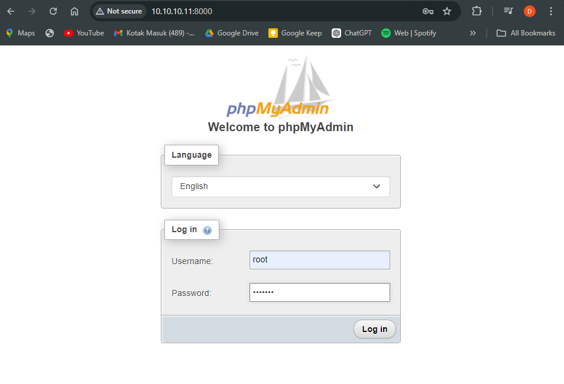
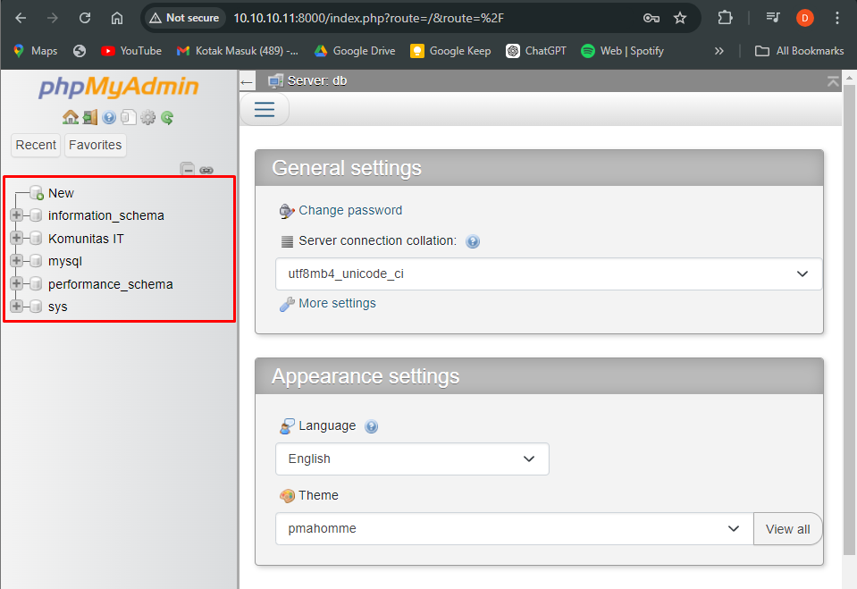

<!-- Heading -->
<h1 align="center">Management Container</h1>

## Container Resource Limit
secara default saat container berjalan maka dia akan menggunakan semua CPU dan Memory yang tersedia pada sistem host, tentunya hal ini akan memengaruhi container lain jika resource yang di gunakan terlalu banyak. untuk itu Container Resource Limit ini perlu di atur saat pembuatan container.
 ```js
dika@docker-dika-node01:~$ sudo docker run -d --name db-mysql --memory 100m --cpus 0.5 -e MYSQL_ROOT_PASSWORD=kits123 -e MYSQL_DATABASE="Komunitas IT" -p 3306:3306 mysql:latest
```

## Container Link 
setelah container mysql sudah terinstall disini buat container phpmyadmin dan hubungkan ke container mysql. gunakan opsi --link untuk menghubungkan ke container database mysql
 ```js
dika@docker-dika-node01:~$ sudo docker run -d --name phpmyadmin --link db-mysql:db -p 8000:80 phpmyadmin:latest
```

>Open browser and access ip_address:port
<p align="center">
  
</p>
<p align="center">
  
</p>
